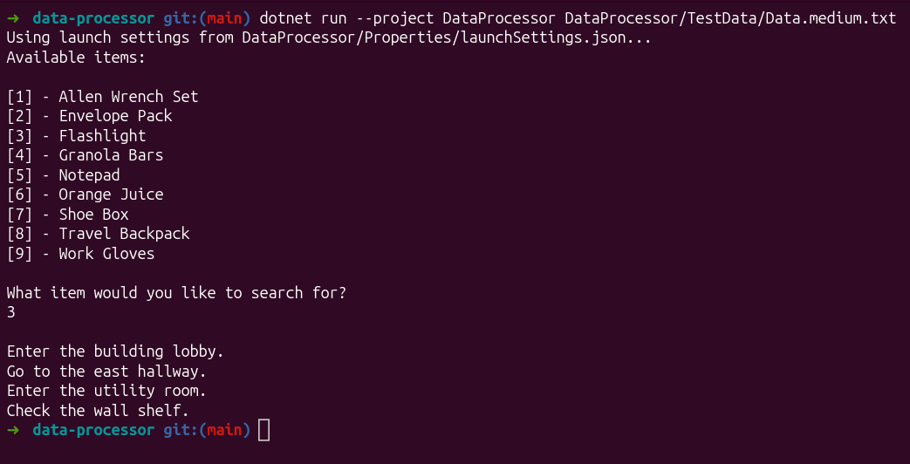

My take on **Data File processing console .NET app** which finds path to specified Item.

**Tests are available** - xUnit v3, Allure 3, Microsoft Testing Platform.

### Project has 2 branches:

- `main` - the approach considered to be **the most optimal** for the current problem.
- `node-approach` - the approach with Node class usage.
- `bonus-ai-orchestrator` - relying on local LLM for parsing and steps defining. 




## Features

- Shows the list of items.
- Defines exact path to item selected by user.
- Notifies about wrongly provided item selection and initiates input re-try.
- Throws friendly errors depending on the situation:
    - Not provided file path.
    - Wrong file path.
    - Corrupted file.

## How to run the app

1. Ensure you have installed .NET environment
2. Clone the project

```bash
git clone https://github.com/notNullThen/data-processor.git
```

3. Navigate the cloned directory
```bash
cd data-processor/
```

4. Run the application
```bash
dotnet run --project DataProcessor DataProcessor/TestData/Data.medium.txt
```


## How to run tests

From the project root, run:

```bash
dotnet test
```


To generate and open the Allure report, run:

```bash
dotnet test && allure generate DataProcessor.Tests/bin/Debug/net10.0/TestResults/allure-results && allure open allure-report
```
